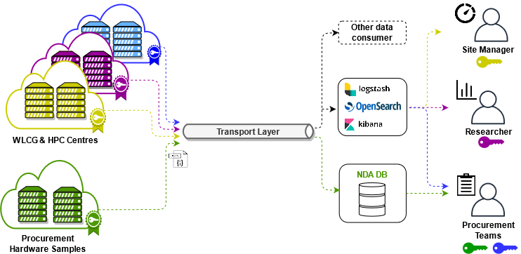

# HEP Benchmark Suite

| master |
| -------- |
|  [](https://gitlab.cern.ch/hep-benchmarks/hep-benchmark-suite/-/pipelines?ref=master)     |
[](https://gitlab.cern.ch/hep-benchmarks/hep-benchmark-suite/-/commits/master)|
| [](https://gitlab.cern.ch/hep-benchmarks/hep-benchmark-suite/-/pipelines?ref=master)|

| License | Python Support | Latest Release |
| --------- | -------- | -------- |
| [](https://www.gnu.org/licenses/gpl-3.0) | [](https://www.python.org/downloads/release/python-368/) |  |

[[_TOC_]]

# Feedback/Support

Feedback and support questions are welcome primarily through [GGUS tickets](https://w3.hepix.org/benchmarking/how_to_run_HS23.html#how-to-open-a-ggus-ticket) or in the HEP Benchmarks Project
[Discourse Forum](https://wlcg-discourse.web.cern.ch/c/hep-benchmarks).

For instructions on how to run the HEPScore23 benchmark, please refer to the [dedicated HEPiX Benchmark page](https://w3.hepix.org/benchmarking/how_to_run_HS23.html). The HEPScore23 scores for the benchmarked servers are reported in this [table](https://w3.hepix.org/benchmarking/scores_HS23.html).

## About

The HEP Benchmark Suite is a toolkit which orchestrates different benchmarks in one single application for characterizing the performance of individual and clustered heterogeneous hardware.

It is built in a modular approach to target the following use cases in HEP computing:

1. **Mimic the usage of WLCG resources for experiment workloads**
   - Run workloads representative of the production applications running on WLCG.
1. **Allow collection of a configurable number of benchmarks**
   - Enable performance studies on heterogeneous hardware.
1. **Collect the hardware metadata and the running conditions**
   - Compare the benchmark outcome under similar conditions.
1. **Have prompt feedback about executed benchmarks**
   - By publishing results to a monitoring system.
1. **Probe randomly assigned slots in a cloud environment**
   - In production can suggest deletion and re-provisioning of under-performing resources.

For instructions on how to run the HEPScore23 benchmark, please refer to the [dedicated HEPiX Benchmark page](https://w3.hepix.org/benchmarking/how_to_run_HS23.html). The HEPScore23 scores for the benchmarked servers are reported in this [table](https://w3.hepix.org/benchmarking/scores_HS23.html).

## Benchmark suite architecture

_The figure shows the high level architecture of the benchmark suite._

<div align="center">
  
</div>

A configurable sequence of benchmarks may be launched by the HEP Benchmark Suite.

Benchmark results are aggregated into a single JSON document, together with the hardware metadata (CPU model, host name, Data Centre name, kernel version, etc.)

Optionally, the final report can be sent to a transport layer, to be further digested and analysed by broker consumers.

Users may also execute the suite in stand-alone mode without result reporting -  see [How to run](#how-to-run) for further details.

### Integration status

The current Hep-Benchmark-Suite integration status.

- Benchmarks

Benchmark   | Docker             | Singularity
:---:       | :---:              | :---:
HEPSpec06   | :white_check_mark: | :white_check_mark:
SPEC2017    | :white_check_mark: | :white_check_mark:
HEP-Score   | :white_check_mark: | :white_check_mark:

- Plugins

Plugin        | Status |
:---:         | :--:               |
HW-Metadata   | :white_check_mark: |
ActiveMQ      | :white_check_mark: |
OpenSearch    | :white_check_mark: |

### Available benchmarks

The HEP Benchmark Suite is delivered **ready-to-run** with a [default yaml](hepbenchmarksuite/config/benchmarks.yml) configuration file (see [How to run](#how-to-run)). The  currently available benchmarks are:

- [HEP-score](https://gitlab.cern.ch/hep-benchmarks/hep-score)
- [HS06](https://w3.hepix.org/benchmarking.html)
- [SPEC CPU2017](https://www.spec.org/cpu2017/)
- Fast benchmarks (should not be used for performance measurements):
  - [DIRAC Benchmark (DB12)](hepbenchmarksuite/db12.py)
  - [ATLAS Kit Validation](https://gitlab.cern.ch/hep-benchmarks/hep-workloads/blob/master/atlas/kv/atlas-kv/DESCRIPTION)

**Due to proprietary license requirements, HS06 and SPEC CPU 2017 must be provided by the end user.** This tool will work with either a pre-installed or tarball archive of SPEC software.

### Example of HEP Benchmark Suite workflow

<div align="center">
  
</div>

_The above figure shows an example adoption of the HEP Benchmark suite for a multi-partition deployment._

Servers belonging to different data centres (or cloud providers) are benchmarked by executing the HEP Benchmark Suite in each of them. The mentioned servers can be _bare metal_ servers as well as _virtual machines_. After running, the final JSON report is published to an AMQ message broker (_shown as transport layer above_).

In this example, an AMQ consumer may then digest the messages from the broker, and insert them in an Elasticsearch cluster so that the benchmark results can be aggregated and visualized in dashboards. Metadata (such as UID, CPU architecture, OS, Cloud name, IP address, etc.) are also included into the searchable results.

Users are free to build/use transport and aggregation/visualization tools of their choice to ingest the generated JSON results.

## Quick Start: Running the Suite Examples

This is a short list of configuration examples to run the suite.
For an in depth understanding of the installation and configuration options refer to the dedicated [section](#installation)

1. HEPscore example runscripts:
   - [HEPscore default configuration](examples/hepscore/run_HEPscore.sh)
   - [Run HEPscore custom configuration](examples/hepscore/run_HEPscore-slim_on_grid.sh)
   - [Run HEPscore default configuration on HPC via SLURM](examples/hepscore/run_HEPscore_on_HPC_slurm.sh)
2. HEP SPEC example runscripts:
   - [Run](examples/spec/run_HS06_32bits.sh) HS06 32 bits
   - [Run](examples/spec/run_HS06_64bits.sh) HS06 64 bits
   - [Run](examples/spec/run_SPECCPU2017_intrate.sh) SPEC CPU 2017 Int Rate
   - [Run](examples/spec/run_SPECCPU2017_cpp.sh) SPEC CPU 2017 Rate cpp

You need to download the runscript you are interested in and run in the terminal.

## Installation

> **This package requires `pip3` >= 21.3.1, `python3.6+` and `git`**\
  If your `pip3 --version` is older, please update with: `pip3 install --user --upgrade pip` before installing!

### Local user space

```sh
python3 -m pip install --user git+https://gitlab.cern.ch/hep-benchmarks/hep-benchmark-suite.git
```

This will install the suite to the user's home directory:

```sh
~/.local/bin/bmkrun
```

You can additionally add the executable to you $PATH:

```sh
export PATH=$PATH:~/.local/bin
```

### Python virtual environments (minimum footprint)

There are cases on which the user would like to keep current Python3 library versions and have a minimum footprint of newly installed packages. For such purposes, it is possible to install the `hep-benchmark-suite` using [Python Virtual Environments](https://docs.python.org/3/tutorial/venv.html). This is the desired approach when the user requires a minimum footprint on the system.

```sh
export MYENV="bmk_env"        # Define the name of the environment.
python3 -m venv $MYENV        # Create a directory with the virtual environment.
source $MYENV/bin/activate    # Activate the environment.
python3 -m pip install git+https://gitlab.cern.ch/hep-benchmarks/hep-benchmark-suite.git
```

_Note: When using virtual environments, hep-score will also be installed in this environment._

### Limited connectivity (wheel installation)

An alternative installation method, not requiring git, is based on python wheels, which is suitable for environments with limited connectivity. All python wheels can be found [here](https://hep-benchmarks.web.cern.ch/hep-benchmark-suite/releases/).
For example:

```sh
export SUITE_VERSION=3.0
export SUITE_RELEASE=hep-benchmark-suite-wheels-3.0rc19-py39-none-linux_2_28_x86_64.tar 
wget https://hep-benchmarks.web.cern.ch/hep-benchmark-suite/releases/${SUITE_VERSION}/${SUITE_RELEASE}
tar -xvf ${SUITE_RELEASE}
python3 -m pip install suite_wheels*/*.whl
```

## How to run

The python executable `bmkrun` can be added to the user's `$PATH`, and launched directly. The `bmkrun` requires one argument to be able to execute:  `--config`.
Users are free to provide [command-line arguments](#description-of-all-arguments), or edit the [`benchmarks.yml`](hepbenchmarksuite/config/benchmarks.yml) file directly.

- Running the HEP Benchmark Suite with default configuration (hepscore is the default benchmark)

  ```sh
  bmkrun -c default
  ```

- Execute with an alternative configuration

  ```sh
  bmkrun -c <config path>
  ```

Points of attention:

- **All CLI arguments have override effect.** For instance, if user has defined multiple benchmarks on the configuration file and specify only one with the `--benchmarks` option, only this benchmark will be executed.

- The aggregated results of the selected benchmarks are written to the location defined by the `--rundir=` argument or `rundir` in the `yaml` file.

- By default, results are retained locally and are not transmitted to any remote endpoint, AMQ (the official approach), or OpenSearch (an alternative approach). To publish the results, please refer to the relevant sections: [Advanced Message Queuing (AMQ)](#Advanced-Message-Queuing-(AMQ)), [OpenSearch](#OpenSearch)) section.

- Benchmarks are executed in sequence.

- The following benchmarks: `hepscore`, `hs06`, `spec2017` are configured in their appropriate configuration sections.

- If you want to run custom benchmark based on custom workloads you should follow the instructions described in [hep-score](https://gitlab.cern.ch/hep-benchmarks/hep-score#configuring-hepscore) and [hep-workloads](https://gitlab.cern.ch/hep-benchmarks/hep-workloads#add-a-new-workload)

- In the case of running HS06, and/or SPEC CPU2017, the benchmark will look for the installation at the specified `hepspec_volume:`, and if it does not exist, it will attempt to install it via tarball argument `url_tarball:`, as defined in the [`benchmarks.yml`](hepbenchmarksuite/config/benchmarks.yml)).

- Please have a look at the [Examples](#examples) section.

## Plugins

### Hardware metadata

The suite ships with a [hardware metadata plugin](hepbenchmarksuite/plugins/extractor.py) which is responsible to collect system hardware and software information. This data is then compiled and reported in the results json file.

This plugin relies on system tools such as: `lscpu`, `lshw`, `dmidecode`. Some of these tools require escalated privileges for a complete output. Please take this into consideration if some outputs are empty in the final json report.

Read [Plugins README.md](https://gitlab.cern.ch/hep-benchmarks/hep-benchmark-suite/-/tree/master/hepbenchmarksuite/plugins?ref_type=heads) for more information about the HEP Benchmark Suite Plugins.

<div align="center">
  
</div>

### Advanced Message Queuing (AMQ)

AMQ publishing is implemented using the [STOMP protocol](https://stomp.github.io/). Users must provide either a valid username/password or key/cert pair, in addition to the server and topic. The relevant section of the [config yaml](hepbenchmarksuite/config/benchmarks.yml) is given below. You must then pass the argument `--publish` to the suite.

#### username/password settings

```yaml
activemq:
  server: some-server.com
  topic: /topic/my.topic
  username: user
  password: secret
  port: 12345
```

#### user cert settings

```yaml
activemq:
  server: some-server.com
  topic: /topic/my.topic
  key: /path/key-file.key
  cert: /path/cert-file.pem
  port: 12345
```

Please note that key/cert authentication is preferred to publish the results to the CERN AMQ Broker.

In order to authenticate this way, you can request a grid user certificate from the [CERN Certification Authority](https://ca.cern.ch). There you can check [whether you are elegible for a certificate](https://ca.cern.ch/ca/certificates/CheckAccount.aspx) as well as [request the certificate itself](https://ca.cern.ch/ca/user/Request.aspx?template=EE2User).

As of 21 Jan 2025, the certificate is issued in a single PKCS#12 file (.p12) containing both the certificate and the key. So as to use it in this application, it needs to be split into a certificate and a key PEM file by:

```sh
openssl pkcs12 -in user.p12 -out user.crt.pem -clcerts -nokeys
openssl pkcs12 -in user.p12 -out user.key.pem -nocerts -nodes
```

Optionally, you can ommit the `-nodes` flag if you want to encrypt the private key. Then, to obtain the user DN in the format required by the Messaging Service (AMQ Broker) for the whitelisting, run:

```sh
openssl x509 -noout -in user.crt.pem -subject -nameopt RFC2253
```

which should output something similar to:

```
subject=CN=Name Surname,CN=123456,CN=username,OU=Users,OU=Organic Units,DC=cern,DC=ch
```

Pass this information to the Messaging Team alongside the server and topic to set up the authentication. Additional information on user certificates can be found at [the official CERN CA documentation](https://ca.cern.ch/ca/Help).

### OpenSearch

OpenSearch publishing is implemented using the [opensearch-py library](https://github.com/opensearch-project/opensearch-py). Users must provide a valid username/password, in addition to the server and index. The relevant section of the [config yaml](hepbenchmarksuite/config/benchmarks.yml) is given below. You must then pass the argument `--publish` to the suite.

#### username/password settings

```yaml
opensearch:
  server: some-server.com
  index: my-index
  username: user
  password: secret
  port: 12345
```

## Description of all arguments

The `-h` option provides an explanation of all command line arguments

```none
$ bmkrun --help
-----------------------------------------------
High Energy Physics Benchmark Suite
-----------------------------------------------
This utility orchestrates several benchmarks

Author: Benchmarking Working Group
Contact: https://wlcg-discourse.web.cern.ch/c/hep-benchmarks

optional arguments:
  -h, --help            Show this help message and exit
  -b, --benchmarks BENCHMARKS [BENCHMARKS ...]
                        List of benchmarks
  -c, --config [CONFIG]
                        Configuration file to use (yaml format)
  -d, --rundir [RUNDIR]
                        Directory where benchmarks will be run
  -e, --export          Export all json and log files from rundir and
                        compresses them.
  -m, --mode [{singularity,docker}]
                        Run benchmarks in singularity or docker containers.
  -n, --ncores [NCORES] Number of cpus to run the benchmarks.
  -t, --tags            Enable reading of user tags from ENV variables
                        (BMKSUITE_TAG_{TAG}). Tags specified in configuration
                        file are ignored.
  -p, --publish         Enable reporting via AMQ/OpenSearch credentials in YAML file.
  -s, --show            Show running config and exit.
  -V, --extra_volumes VOLUME [VOLUME ...]
                        List of additional volumes to mount on the container.
  -v, --verbose         Enables verbose mode. Display debug messages.
  --version             Show program's version number and exit
-----------------------------------------------
```

### Typical use cases

- Show default configuration.

    ```sh
    bmkrun -c default --show
    ```

- Specify custom tags via ENV variables.

    ```sh
    # All tags should start with BMKSUITE_TAG_
    export BMKSUITE_TAG_MYTAG="My custom tag"
    export BMKSUITE_TAG_SECONDTAG=$(uptime)

    # The --tags flag enables the reading of ENV variables
    # ignores tags specified in config file
    bmkrun -c default --tags
    ```

- Run a test benchmark DB12 (should not be used for system benchmarking)

    ```sh
    bmkrun -c default -b db12
    ```

- Run HS06 and SPEC2017. 64bit mode by default (Alternate config should be based on [`benchmarks.yml`](hepbenchmarksuite/config/benchmarks.yml))

    ```sh
    bmkrun -c <alternate config>  -b hs06 spec2017
    ```

- Parallel running (HPC, Cloud, etc)

    By default the suite pulls all workload images and files needed during execution. This traffic can be eliminated by pre-caching them in a shared location (dramatically speeding up runs across nodes that share access to a network storage, or where compute nodes have network restrictions).

    Before running with HEPscore:

    ```sh
    # set a common cachedir env to store a single copy of the images
    # this must be accessible across all nodes at the same mountpoint (or symlink)
    export SINGULARITY_CACHEDIR=/cephfs/user/johndoe/.singularity
    ./populate_image_cache.sh [optional yourconfig.yml]
    srun bmkrun -c <yourconfig.yml> # SLURM job submission for example
    ```

    where [populate_image_cache.sh](hepbenchmarksuite/examples/populate_image_cache.sh) is used to pull all needed images before launching a benchmarking job.
    HS06/17 can load the SPEC distribution from a local file by setting the location to `url_tarball: "file:/abs/path/HS06.tar.bz2"`