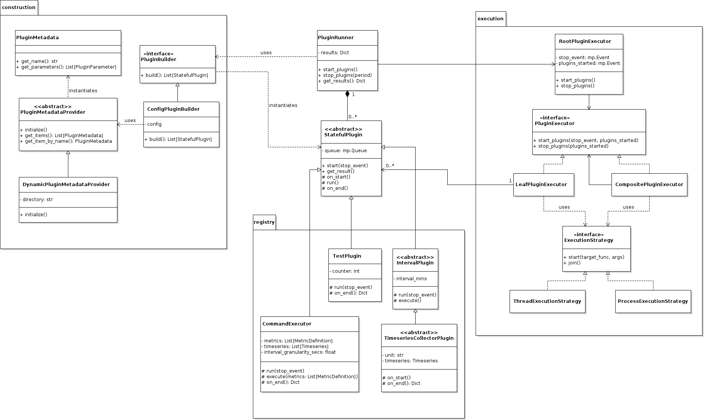

# Plugins

Plugins provide the means of adding functionality that runs independently of the suite.
Typically, it allows collecting metrics that are otherwise not collected by the suite, such as memory usage.
The plugins are inherently designed to run concurrently; thus, not interfering with the 
benchmarking process.

### Phases
Plugins are executed by the suite in three major phases:
1. Before benchmarking starts (pre) - useful for collecting metrics when the system is idle.
2. During each benchmark
3. After benchmarking finishes (post)

The duration of the “pre” and “post” phases can be configured. By default, they run only for a brief moment, 
giving a chance to retrieve a single measurement. See the [Configuration](#Configuration) section.

## Usage

Using a plugin requires the following actions:
* checking the necessary plugin exists
* configuring the plugin in the configuration file of the suite
* (optional) configuring the duration of the “pre” and “post” phases

### Configuration 

The suite configuration should include a `plugins` section, which lists all plugins that should be used.
The plugin names in the configuration must match the class names of the plugins (case-insensitively) in the
plugin registry `hepbenchmarksuite/plugins/registry`. 
The suite searches for plugins in this location. 
All non-default parameters of the plugin's constructor must be specified in the configuration.

Example: Run the CommandExecutor plugin to collect CPU frequency every minute.
```yaml
global:
  ...
activemq:
  ...
hepscore:
  ...
plugins:
    CommandExecutor:
        metrics:
            cpu-frequency:
                command: cpupower frequency-info -f
                regex: 'current CPU frequency: (?P<value>\d+).*'
                unit: kHz
                interval_mins: 1
```

The duration of the “pre” and “post” phases can be configured by adding the following configuration options 
under the `global` section: 
* `pre-stage-duration` 
* `post-stage-duration`  

Example:
Stay five minutes in both the “pre” and “post” stage.
```yaml
global:
  rundir: ...
  benchmarks: 
    ...
  tags:
    ...
  pre-stage-duration: 5
  post-stage-duration: 5
```

### Results

The results produced by these plugins are saved in the report created by the suite, alongside the benchmark 
scores, HW and SW information, etc. The results are located under the `plugins` keyword where
each plugin has its own section. Then, the results for each phase is listed.

The specific report of the plugin is entirely up to the plugin itself. Whatever information is returned
by the `on_end` method of the plugin will be saved in the report.

So if the suite is configured to run the `CommandExecutor` and collect the _cpu-frequency_ and the _power-consumption_, 
then the `plugin` section of the following format will be generated in the final report: 

```json
{
  "plugins": {
    "CommandExecutor": {
      "pre": {
        "cpu-frequency": {
          "tstart": "2023-06-22T09:40:40.634377Z",
          "tend": "2023-06-22T09:40:40.634377Z",
          "values": [
            1269082.0
          ],
          "statistics": {
            "min": 1269082.0,
            "mean": 1269082.0,
            "max": 1269082.0
          },
          "config": {
            "interval_mins": 1.0,
            "command": "cpupower frequency-info -f",
            "regex": "current CPU frequency: (?P<value>\\d+).*",
            "unit": "kHz",
            "aggregation": "sum"
          }
        },
        "power-consumption": {}
      },
      "hepscore": {
        "cpu-frequency": {},
        "power-consumption": {}
      },
      "post": {
        "cpu-frequency": {},
        "power-consumption": {}
      }
    }
  }
}
```

### Using existing plugins

The following table lists the existing plugins:

| Plugin          | Description                                                                             |
|-----------------|-----------------------------------------------------------------------------------------|
| CommandExecutor | Executes command utilities in defined intervals and collects values from their outputs. |
| TestPlugin      | The simplest implementation of a plugin that only increases a counter.                  |

#### CommandExecutor
Executes specified commands and retrieves the values by applying the regular expression on the output 
of the command. Saves the values as timeseries. Generates a summary report at the end of its lifetime.

See the example configuration of this plugin: 
```yaml
plugins:
    CommandExecutor:
        metrics:
            cpu-frequency:
                command: cpupower frequency-info -f
                regex: 'current CPU frequency: (?P<value>\d+).*'
                unit: kHz
                interval_mins: 1
            power-consumption:
                command: ipmitool sdr elist
                regex: 'PS \d Output.* (?P<value>\d+) Watts'
                unit: W
                interval_mins: 1
                aggregation: sum
            used-memory:
                command: free -m
                regex: 'Mem: *(\d+) *(?P<value>\d+).*'
                unit: MiB
                interval_mins: 1
```
Each metric starts with its name, which can be arbitrary, but will be included in the final report.
The following parameters must be specified for each metric: 
* **command**: the command to be run in regular intervals
* **regex**: a regular expression to retrieve a single or more numeric values from the output as a result of running the command
* **unit**: a user-defined unit of the collected metric, which will be propagated into the final report.
It does not affect the plugin in any way.
* **interval_mins**: a floating-point value defining how often the value should be collected. The plugin internally 
defines minimal granularity (by default 10 seconds). It will not run the command more often than that.
* **aggregation**: an aggregation function to use in case the regular expression finds multiple occurrences of the value.
Default function is sum.

See the `examples/plugins/catalogue.json` for other examples of useful configurations.
**Run each command** on the target node **before running the suite** to check that the regular expression 
corresponds to the produced output.


### Creating new plugins

New plugins can be created by inheriting from the `StatefulPlugin` or any other descendant of this class.
The new plugin **must be placed** in the registry directory. 
Classes that are not descendents of the `StatefulPlugin` will not be recognized by the suite.

#### Deriving from StatefulPlugin
The `StatefulPlugin` is the base class for all plugins. It provides the most flexibility on the implementation of 
the plugin. The derived class must implement all abstract methods---`run`, and `on_end`. Optionally,
it can also implement `on_start`. The plugin **must stop** running when it is requested by the Event.

#### Deriving from IntervalPlugin
The `IntervalPlugin` implements the `run` method such that it executes the abstract `execute` method in
regular intervals. This is especially useful for collecting measurements.
The `execute` and `on_end` methods must be implemented.

#### Deriving from TimeseriesCollectorPlugin
The `TimeseriesCollectorPlugin` derives from the `IntervalPlugin` and adds the necessary functionality 
for collecting timeseries data by adding the Timeseries object and implementing the `on_start` and `on_end`
methods. The derived classes must implement the `execute` method and append the collected values
to the timeseries object.


## Implementation overview

The architecture is divided into four parts:
* entry point, 
* construction,
* execution,
* and registry.

The suite uses the entry point, `PluginRunner`, to orchestrate the construction and execution of the plugins
located in the registry.



#### Entry point
The entry point, `PluginRunner`, orchestrates the registry, construction, and
execution:
* stores the plugin instances, 
* provides an interface for starting and stopping the plugins,
* and collects the produced results.

#### Registry

The registry is a Python package with modules containing the plugins.
It is located in `hepbenchmarksuite/plugins/registry`.
Only classes as descendants of StatefulPlugin are considered as
plugins; rest is ignored.

#### Construction

Instantiates plugins specified in the configuration located in the plugin registry.
The plugin registry is dynamically searched for plugins.

`PluginBuilder` instantiates plugins. 
`PluginMetadataProvider` provides information about which plugins are available together with their parameters.

#### Execution

Plugins are executed concurrently to the HEP suite. Each plugin runs in its own thread or process,
depending on the internal implementation of the suite. This is configurable in the `PluginRunner`. 
Implementation-wise, this requires
synchronization and results passing from threads or sub-processes to the main thread/process.

